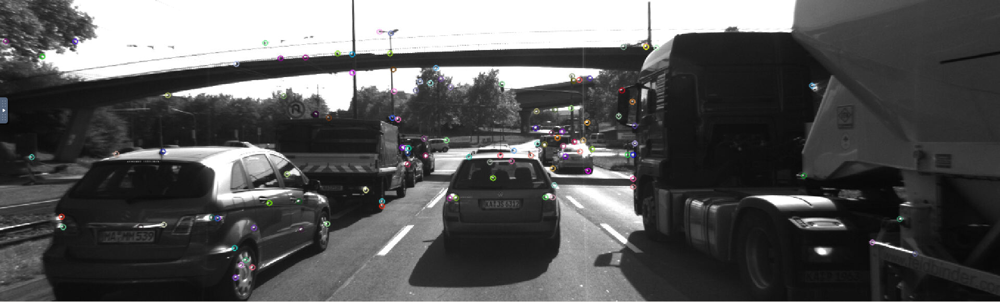
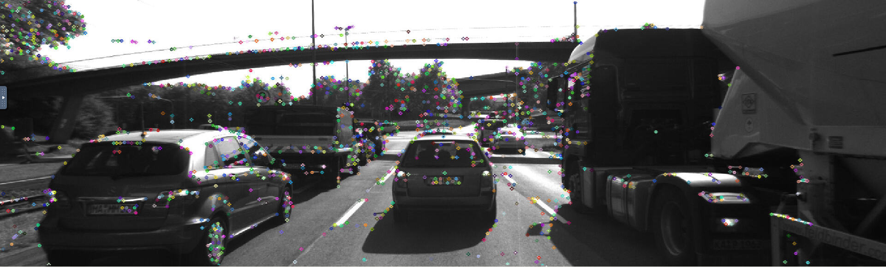
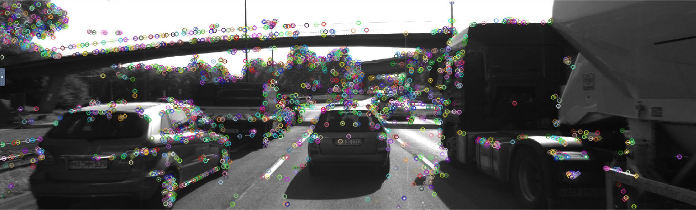
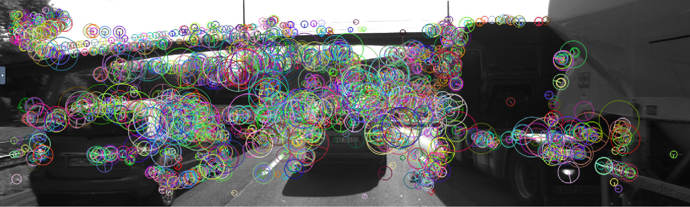
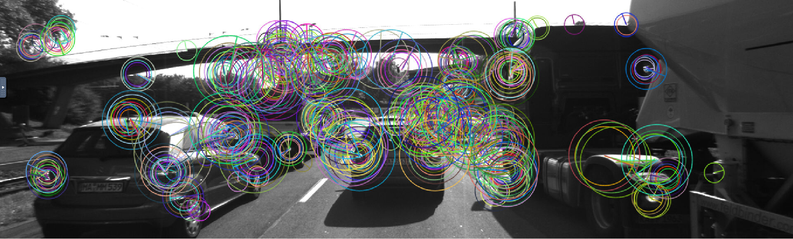
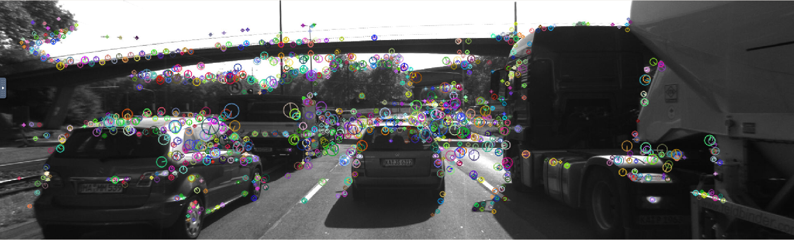
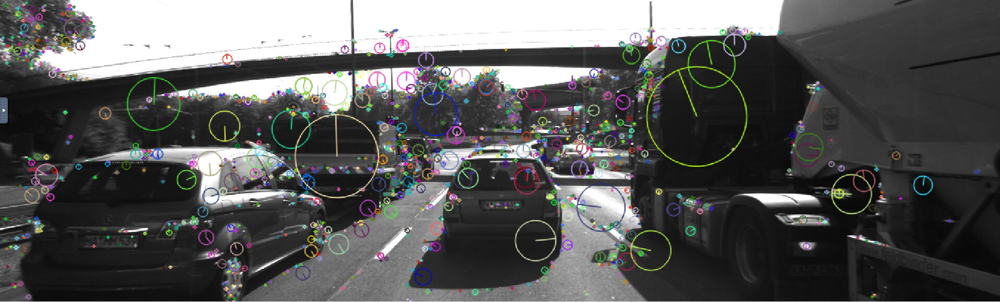
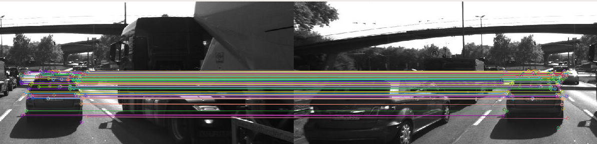
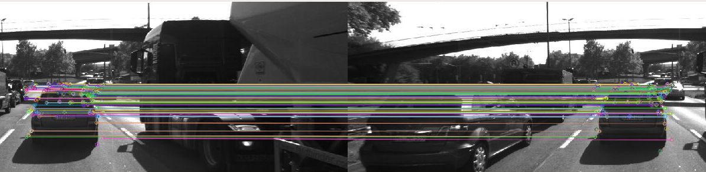
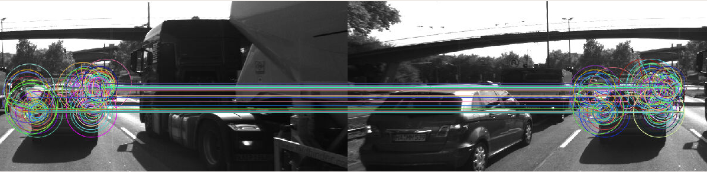

# SFND 2D Feature Tracking

The idea of the camera project is to build a collision detection system - that's the overall goal for the Final Project. As a preparation for this, you will now build the feature tracking part and test various detector / descriptor combinations to see which ones perform best. This mid-term project consists of four parts:

* First, you will focus on loading images, setting up data structures and putting everything into a ring buffer to optimize memory load. 
* Then, you will integrate several keypoint detectors such as HARRIS, FAST, BRISK and SIFT and compare them with regard to number of keypoints and speed. 
* In the next part, you will then focus on descriptor extraction and matching using brute force and also the FLANN approach we discussed in the previous lesson. 
* In the last part, once the code framework is complete, you will test the various algorithms in different combinations and compare them with regard to some performance measures. 

------

## Analysis for MP7 ~ MP9

Following are  my analysis for the project part7 to part9:

### MP.7

The number of key-points on the preceding vehicle for all 10 images are listed in the table:

| frames\Detectors | Harris            | SHITOMASI          | FAST               | BRISK              | ORB               | AKAZE               | SIFT                |
| ---------------- | ----------------- | ------------------ | ------------------ | ------------------ | ----------------- | ------------------- | ------------------- |
| **frame1**       | 115points/36.95ms | 1370points/25.4ms  | 1824points/1.025ms | 2757points/55.18ms | 500points/18.12ms | 1351points/122.72ms | 1438points/168.15ms |
| **frame2**       | 98points/17.07ms  | 1301points/12.29ms | 1832points/1.23ms  | 2777points/47.10ms | 500points/8.32ms  | 1327points/105.61ms | 1371points/123.40ms |
| **frame3**       | 113points/17.95ms | 1361points/16.78ms | 1810points/1.08ms  | 2741points/47.07ms | 500points/11.21ms | 1311points/100.24ms | 1380points/124.06ms |
| **frame4**       | 121points/17.38ms | 1358points/12.48ms | 1817points/1.11ms  | 2735points/47.14ms | 500points/7.68ms  | 1351points/105.48ms | 1335points/123.52ms |
| **frame5**       | 160points/16.91ms | 1333points/14.75ms | 1793points/1.19ms  | 2757points/47.57ms | 500points/7.77ms  | 1360points/101.04ms | 1305points/124.77ms |
| **frame6**       | 383points/32.57ms | 1284points/11.98ms | 1796points/1.15ms  | 2695points/47.21ms | 500points/7.54ms  | 1347points/104.22ms | 1370points/124.01ms |
| **frame7**       | 85points/16.36ms  | 1322points/12.01ms | 1788points/1.14ms  | 2715points/46.80ms | 500points/7.66ms  | 1363points/105.08ms | 1396points/124.95ms |
| **frame8**       | 210points/19.35ms | 1366points/15.16ms | 1695points/1.11ms  | 2628points/46.47ms | 500points/7.83ms  | 1331points/105.46ms | 1382points/133.22ms |
| **frame9**       | 171points/17.91ms | 1389points/12.04ms | 1749points/1.15ms  | 2639points/46.75ms | 500points/8.03ms  | 1357points/107.08ms | 1463points/136.62ms |
| **frame10**      | 281points/22.23ms | 1339points/12.19ms | 1770points/1.16ms  | 2672points/46.96ms | 500points/8.46ms  | 1331points/110.19ms | 1422points/125.57ms |

The following pictures demonstrate the detector results:

* Harris

  

* SHITOMASI

  

* FAST

  

* BRISK

  

* ORB

  

* AKAZE

  

* SIFT

  

Summary:

Harris has very small number of key points. ORB's number of key points are limited by the detector parameter. BRISK has very large number of key points. All 	the algorithm has good key points distributions. Overall, FAST seems to have some performance advantage over good key point quality and quantity.

### MP.8

The following matrix shows the detector-descriptor combinations' key points match counts for the key points on the preceding vehicle.

| Descriptor\Detector | Harris | SHITOMASI | FAST | BRISK | ORB  | AKAZE | SIFT |
| ------------------- | ------ | --------- | ---- | ----- | ---- | ----- | ---- |
| **BRISK**           | 137    | 756       | 858  | 1546  | 728  | 1204  | 586  |
| **BRIEF**           | 164    | 928       | 1042 | 1676  | 530  | 1257  | 693  |
| **ORB**             | 157    | 891       | 1015 | 1480  | 731  | 731   | x    |
| **FREAK**           | 140    | 758       | 838  | 1494  | 396  | 1179  | 588  |
| **AKAZE**           | x      | x         | x    | x     | x    | 1249  | x    |
| **SIFT**            | 157    | 910       | 993  | 1617  | 736  | 1263  | 790  |

### MP.9 

The following matrix shows the average time, in ms, for the detector-descriptor combination to finish processing a single frame.

| Descriptor\Detector | Harris | SHITOMASI | FAST     | BRISK  | ORB       | AKAZE  | SIFT   |
| ------------------- | ------ | --------- | -------- | ------ | --------- | ------ | ------ |
| **BRISK**           | 420    | 431.85    | 412.08   | 876.76 | 409.13    | 519.54 | 541.67 |
| **BRIEF**           | 23.60  | 24.98     | **8.36** | 443.82 | **10.82** | 122.99 | 122.81 |
| **ORB**             | 23.63  | 22.30     | **5.11** | 456.00 | 15.17     | 121.23 | x      |
| **FREAK**           | 64.11  | 71.67     | 60.44    | 502.11 | 508.59    | 172.88 | 216.51 |
| **AKAZE**           | x      | x         | x        | x      | x         | 222.82 | x      |
| **SIFT**            | 218.98 | 64.21     | 164.30   | 928.58 | 262.83    | 230.06 | 279.41 |

The top 3 combinations are FAST-BRIEF, FAST-ORB, ORB-BRIEF.  

Below are some match results for the preceding vehicle:

- FAST-BRIEF

  

- FAST-ORB

  

- ORB-BRIEF

  

------

## Dependencies for Running Locally

* cmake >= 2.8
  * All OSes: [click here for installation instructions](https://cmake.org/install/)
* make >= 4.1 (Linux, Mac), 3.81 (Windows)
  * Linux: make is installed by default on most Linux distros
  * Mac: [install Xcode command line tools to get make](https://developer.apple.com/xcode/features/)
  * Windows: [Click here for installation instructions](http://gnuwin32.sourceforge.net/packages/make.htm)
* OpenCV >= 4.1
  * This must be compiled from source using the `-D OPENCV_ENABLE_NONFREE=ON` cmake flag for testing the SIFT and SURF detectors.
  * The OpenCV 4.1.0 source code can be found [here](https://github.com/opencv/opencv/tree/4.1.0)
* gcc/g++ >= 5.4
  * Linux: gcc / g++ is installed by default on most Linux distros
  * Mac: same deal as make - [install Xcode command line tools](https://developer.apple.com/xcode/features/)
  * Windows: recommend using [MinGW](http://www.mingw.org/)

## Basic Build Instructions

1. Clone this repo.
2. Make a build directory in the top level directory: `mkdir build && cd build`
3. Compile: `cmake .. && make`
4. Run it: `./2D_feature_tracking`.